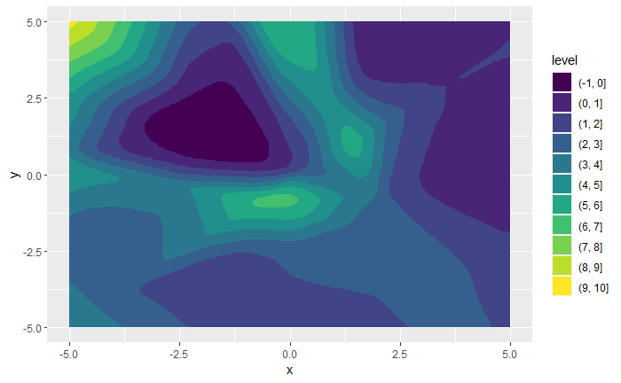
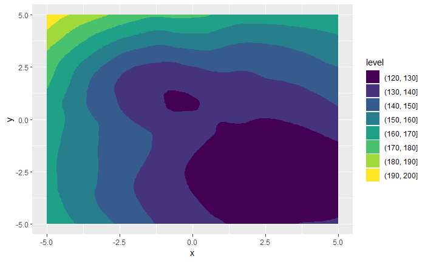

```{r setup, include=FALSE}
knitr::opts_chunk$set(echo = TRUE)
```

## Gliederung

-   Motivation und Zielsetzung
-   Vorgehen und Methodik
-   Versuchsaufbau
-   Bewertungsmatrix
-   Umsetzung und Auswertung
-   Schlussbetrachtung

# Motivation und Zielsetzung

Hanna Steinwender

## Motivation

-   Entwicklung und Bewertung von Optimierungsalgorithmen in realen
    Anwendungen
-   Herausforderung traditioneller Bewertung mit statischen
    Testdatensätzen
-   Notwendigkeit von Testfunktionen für Algorithmen
-   Schwierigkeit bei der Suche nach passenden Testfunktionen
-   Begrenzte Verfügbarkeit von Ground-Truth-Funktionen
-   Modelle mit realen Daten als Ersatz für Ground-Truth-Funktionen
    erstellen

## Zielsetzung

-   Entwicklung von Testfunktionen
-   Approximation von Ground-Truth-Funktionen
-   Erfüllung von Anforderungen: Schwierigkeit, Vielfalt, Kosten,
    Flexibilität, Transparenz
-   Validierung durch Vergleich mit BBOB Function Suite
-   Beitrag zur Optimierungsalgorithmen-Forschung
-   Anwendbarkeit in realen Optimierungsaufgaben

## Forschungsfragen

1.  Ist der Einsatz eines Variational Autoencoder als
    Datenerhebungstrategie sinnvoll?
2.  Ist ein RNN besser geeignet zur Erzeugung der Testfunktion als ein
    Gaußsches Prozessmodell?
3.  Ist der Einsatz von RNN geeignet?

# Vorgehen und Methodik

Hanna Steinwender

## Vorgehen und Methodik

-   Empirischer Ansatz: Durchführung von Experimenten.
-   Datenerhebung
-   Modelltraining
-   Funktionsgenerierung
-   Optimierungsevaluation
-   Erstellung einer Bewertungsmatrix
-   Vergleichsanalyse
-   Generalisierungstests
-   Interpretation und Diskussion

# Versuchsaufbau

Lena Hammerer

## Groundtruths

<br> <br>
{width="47%"}{width="47%"}

## Variable Parameter

(Theorie: (Groundtruth Function))

-   numBbobf \<- 1/24

-   dim \<- 2/3

-   dataGenerationMethod \<- "lhs", "random", "grid"

-   numDataPoints \<- 25/600

-   trainTestSplit \<- 0.8

-   funEval \<- 200/400

## Datenerhebungstrategie

(Theorie: (RS, GS, LHS)) im Versuchsaufbau steht was drin

-   Random Sampling
-   Grid Sampling
-   Latin Hypercube Sampling

## Modellaufbau RNN

(Theorie: (RNN und Gauss und Loss Function (Mean Squared Logarithmic
Error)))

-   Eingangsschicht: layer_dense(units=128, input_shape=2) mit
    aktivierender "Leaky ReLU"-Funktion.
-   Verborgene Schicht: layer_dense(units=32) mit aktivierender "Leaky
    ReLU"-Funktion.
-   Verborgene Schicht: layer_dense(units=128) mit aktivierender "Leaky
    ReLU"-Funktion.
-   Dropout-Schicht: layer_dropout(rate=0.001) mit einer Auslassrate von
    0.001.
-   Verborgene Schicht: layer_dense(units=64) mit aktivierender "Leaky
    ReLU"-Funktion.
-   Ausgangsschicht: layer_dense(units=1, activation="linear") für die
    lineare Ausgabe.

Das Modell verwendet den Mean Squared Logarithmic Error als
Verlustfunktion und den Adam-Optimizer für das Training.

## Optimierung mit Differential Evolution

(Theorie: (Differential Evolution und Popsize))

-   popSize = 4
-   popSize = 10\*dim
-   popSize = 20\*dim

# Bewertungsmatrix

Luisa Ibele

## Grundlegendes Bewertungsschema

-   Grundlegende Parameter der einzelnen Testdurchläufe: 
  - Anzahl Datenpunkte 
  - Datenerhebungsstrategie 
  - Funktion 
  - Dimensionen


-   Bewertung der Modelle und Optimierung anhand verschiedener Kriterien
-   Werteskala von 1-5 Punkte mit:
    -   1: sehr schlecht, schwach
    -   2: schlecht, unterhalb des Erwarteten
    -   3: durschnittlich, akzeptabel
    -   4: gut, überhalb des Erwarteten
    -   5: sehr gut, stark

## Modellbewertung

<x> {width="100%"}

## Gewichtung

-   Durchschnittlicher Trainingsloss - 10%
-   (Visual) Loss Function Verlauf - 30%
-   (Visual) Generated Function vs. Original Function - 40%
-   Performance - 20%

## Optimierungsbewertung

<x> {width="80%"}

## Gewichtung

-   Optimum Wert - 30%
-   Performance - 20%
-   Error / Evaluations - 20%
-   Y / Evaluations - 30%

## Finale Bewertungsmatrix

<x> {width="80%"}

## Gesamtbewertung

-   systematische Analyse und Bewertung der Experimente im Rahmen der
    Modell- und Optimierungsbewertung
-   fundierte Beurteilung der Modell-Leistung, Optimierungsalgorithmen
    und Versuche anhand der gewählten Bewertungskriterien
-   Berücksichtigung von qualitativer und quantitativer Aspekte
-   Gewichtung: Modellbewertung - 30%; Optimierungsbewertung - 70%
-   Bewertung des gesamten Versuchs möglich

## Versuchsbewertung

Bewertung der einzelnen Versuche anhand von: 
- Difficulty 
- Diversity 
- Flexibility 
- Relevance 
- Evaluation cost 
- Non-Smoothing

# Umsetzung und Auswertung

Judith Romer

## Übersicht 1. Experiment

<x> {width="100%"}

## Übersicht 2. Experiment

<x> {width="100%"}

## Übersicht 3. Experiment

<x> {width="100%"}

# Eperiment 1

Judith Romer

## Versuch 1.1.1.2 - Bildvergleich

<center>

<x>{width="42%"}

<x>{width="42%"}{width="42%"}

</center>

## Versuch 1.1.1.2 - Y Wert / Evaluation

<br> <br>
{width="47%"}{width="47%"}

## Versuch 1.1.1.2 - Fehler / Evaluation

<br> <br>
{width="47%"}{width="47%"}

# Experiment 2

Judith Romer

## Versuch 2.2.1.1 - Bildvergleich 2D

<center>

<x>{width="42%"}

<x>{width="42%"}{width="42%"}

</center>

## Versuch 2.2.2.1 - Bildvergleich 3D

<br> <br>
{width="47%"}{width="47%"}

## Versuch 2.2.1.1 & 2.2.2.1 - Y Wert / Evaluation

<br> <br>
{width="47%"}{width="47%"}

## Versuch 2.2.1.1 & 2.2.2.1 - Fehler / Evaluation

<br> <br>
{width="47%"}{width="47%"}

# Experiment 3

Isabel Janez

## VAE mit 50 Datenpunkten Funktion 1

<br> <br>
{width="47%"}{width="47%"}

## VAE mit 1000 Datenpunkten Funktion 1

<br> <br>
{width="47%"}{width="47%"}

## VAE mit 50 Datenpunkten Funktion 24

<br> <br>
{width="47%"}{width="47%"}

## VAE mit 1000 Datenpunkten Funktion 24

<br> <br>
{width="47%"}{width="47%"}

# Beantwortung der Forschungsfragen

Isabel Janez

## Ist der Einsatz eines Variational Autoencoder als Datenerhebungstrategie sinnvoll?

-   Versuch wurde abgebrochen → sehr schlechte Ergebnisse vor allem bei
    50 Datenpunkten
-   nicht in der Lage die Verteilung über gesamten Raum zu lernen
-   Datenpunkteskala passt nur bedingt
-   representiert die 'Realität' nicht ausreichend
-   Dimensionsreduktion führt zu Problemen, dadurch verzerrte /
    gestauchte Darstellung
-   (Annahme) lokale Struktur wird erkannt und repräsentiert die
    Funktion

## 

für das vorliegende Problem konnte der VAE nicht zur Datenerhebung
eingesetzt werden

weiteres Vorgehen:

-   Modellarchitektur überarbeiten
-   GAN
-   CVAE

## Ist ein RNN besser geeignet zur Erzeugung der Testfunktion als ein Gaußsches Prozessmodell?

<center><x> {width="77%"}</center>

## Ist ein RNN besser geeignet zur Erzeugung der Testfunktion als ein Gaußsches Prozessmodell?

<center><x> {width="77%"}</center>

## Ist ein RNN besser geeignet zur Erzeugung der Testfunktion als ein Gaußsches Prozessmodell?

<br> <br> {width="100%"}

## Ist ein RNN besser geeignet zur Erzeugung der Testfunktion als ein Gaußsches Prozessmodell?

Im vorliegenden Fall: nein, ein RNN ist nicht besser geeignet zur
Erzeugung der Testfunktion.

-   überwiegend ist Performance des Gaußschen Prozessmodells besser
-   höchste erreichte Punktzahl in Optimierung ist 3,6 / 5
-   niedrigste erreichte Punktzahl in Optimierung ist 1,3 / 5

## Ist der Einsatz von RNN geeignet?

-   [4\|5] Difficulty (Mehrdimensionalität 2+3, F1 wird gut
    nachgebildet, F24 ist zu komplex)
-   [5\|5] Diversity ()
-   [3\|5] Flexibility ()
-   [1\|5] Relevance ()
-   [1\|5] Evaluation cost ()
-   [1\|5] Non-Smoothing (nein, 2 RNNs hintereinander verworfen,
    Simulaton nicht erstellt)

im vorliegenden Fall: erreichte Punktzahl der Testfunktionen des RNN ist
2,5 / 5

# Schlussbetrachtung

Isabel Janez

## Fazit

-   Graußsche Prozessmodelle im vorliegenden Anwendungsfall besser
    geeignet
-   Anmerkung: es wurde nur die Estimation verglichen; kein Vergleich
    von Simulation
-   Tradeoff zwischen Rechenleistung und Komplexität des RNN

## Verworfene Ansätze

-   VAE als Regressionsmodell
-   VAE wegen Dimensionsreduktion nicht für Datenerhebung geeignet
-   Loss Function selber schreiben
-   L-BFGS-B als Optimierer: Abbruchkriterium funktioniert nicht korrekt
-   2 RNNs hintereinander für Abbildung der lokalen Struktur

## 2 RNN

<center>

<x>{width="42%"}

<x>{width="42%"}{width="42%"}

</center>

## Ausblick

-   mehr Datenpunkte
-   mehr Dimensionen
-   andere Optimierer
-   Abbildung der lokalen Struktur mit dem neuronalen Netz durch
    Erstellung neuer Loss-Funktion, die nicht nur einzelne Punkte
    optimiert, sondern mehrere Punkte betrachtet
-   Vergleich von Graußscher Prozessmodell Simulation anstelle von
    Estimation

# Vielen Dank für die Aufmerksamkeit! Noch Fragen?

## Prüfungsleistung Aufteilung

-   Hanna Steinwender: Folie 1 bis Folie 8
-   Lena Hammerer: Folie 9 bis Folie 14
-   Luisa Ibele: Folie 15 bis Folie 23
-   Judith Romer: Folie 24 bis Folie 36
-   Isabel Janez: Folie 37 bis 54
