```{r setup, include=FALSE}
knitr::opts_chunk$set(echo = TRUE)
```

## Gliederung

-   Motivation und Zielsetzung
-   Vorgehen und Methodik
-   Versuchsaufbau
-   Bewertungsmatrix
-   Umsetzung und Auswertung
-   Schlussbetrachtung

# Motivation und Zielsetzung

Hanna Steinwender

## Motivation

-   Entwicklung und Bewertung von Optimierungsalgorithmen in realen
    Anwendungen
-   Herausforderung traditioneller Bewertung mit statischen
    Testdatensätzen
-   Notwendigkeit von Testfunktionen für Algorithmen
-   Schwierigkeit bei der Suche nach passenden Testfunktionen
-   Begrenzte Verfügbarkeit von Ground-Truth-Funktionen
-   Modelle mit realen Daten als Ersatz für Ground-Truth-Funktionen
    erstellen

## Zielsetzung

-   Entwicklung von Testfunktionen
-   Approximation von Ground-Truth-Funktionen
-   Erfüllung von Anforderungen: Schwierigkeit, Vielfalt, Kosten,
    Flexibilität, Transparenz
-   Validierung durch Vergleich mit BBOB Function Suite
-   Beitrag zur Optimierungsalgorithmen-Forschung
-   Anwendbarkeit in realen Optimierungsaufgaben

## Forschungsfragen

1.  Ist der Einsatz eines Variational Autoencoder als
    Datenerhebungstrategie sinnvoll?
2.  Ist ein DNN besser geeignet zur Erzeugung der Testfunktion als ein
    Gaußsches Prozessmodell?
3.  Ist der Einsatz von DNN geeignet?

# Vorgehen und Methodik

Hanna Steinwender

## Vorgehen und Methodik

-   Empirischer Ansatz: Durchführung von Experimenten.
-   Datenerhebung
-   Modelltraining
-   Funktionsgenerierung
-   Optimierungsevaluation
-   Erstellung einer Bewertungsmatrix
-   Vergleichsanalyse
-   Generalisierungstests
-   Interpretation und Diskussion

# Versuchsaufbau

Lena Hammerer

## Groundtruths

-   *wahre* / *korrekte* Vorhersage für ein gegebenes Problem
-   Referenzpunkt, um die Leistung von ML-Modellen zu bewerten und ihre
    Qualität sicherzustellen
-   Probleme in der Praxis:
    -   (noch) nicht verfügbar
    -   teuer in der Auswertung, eingeschränkte
        Experimentiermöglichkeiten
    -   vertraulich (Veröffentlichung nicht möglich)

[Hansen, N., A. Auger, R. Ros, O. Mersmann, T. Tušar, and D. Brockhoff.
"COCO: A Platform for Comparing Continuous Optimizers in a Black-Box
Setting." Optimization Methods and Software 36, no. 1 (2021): 114--44.
<https://doi.org/10.1080/10556788.2020.1808977>.]{style="font-size: 14px"}

## Groundtruths

-   **f1 Sphere Function**
    -   einfachstes kontinuierliches Domänensuchproblem, da unimodal und
        hochsymmetrisch
-   **f24 Lunacek bi-Rastrigin Function**
    -   Hoch multimodal und trügerisch für evolutionäre Algorithmen mit
        großer Populationsgröße

{width="47%"}{width="47%"}

## Variable Parameter

Ground-Truth-Funktion f1 und f24 mit jeweils 2 oder 3 Dimensionen

``` r:
numBbobf <- 1/24
dim <- 2/3
```

25 oder 600 Datenpunkten mit Random/Grid Sampling oder LHS

``` r:
dataGenerationMethod <- "lhs", "random", "grid"
numDataPoints <- 25/600
```

Split von Trainings- und Evaluationsdaten für die Modellierung

``` r:
trainTestSplit <- 0.8
```

Funktion 200 oder 400 mal evaluieren

``` r:
funEval <- 200/400
```

## Datenerhebungstrategie

**Random Sampling**

-   zufällige werte für `x` und `y` generieren
-   Reproduzierbar durch Random Seed
-   Verteilung entspricht ggf. nicht den tatsächlichen Daten
-   Erzeugung innerhalb von fixen Grenzen

**Grid Sampling**

-   vordefinierte Menge von Parameterkombinationen
-   Reproduzierbar, da jeder Punkt im Parameterraum einmal besucht
-   Fluch der Dimensionen
-   besser geeignet für diskrete Parameter

## Datenerhebungstrategie

**Latin Hypercube Sampling**

-   Kombination der RS und GS Ansätze
-   Parameterraum in gleich wahrscheinliche Intervalle oder Bins entlang
    jeder Dimension unterteilt
-   Aus jedem Bin wird ein Zufallswert ausgewählt
-   Gleichmäßige Verteilung von Stichprobenpunkte über den Parameterraum
-   Repräsentativität wird erhöht

[Mckay, M. D., R. J. Beckman, and W. J. Conover. "A Comparison of Three
Methods for Selecting Values of Input Variables in the Analysis of
Output From a Computer Code." Technometrics 42, no. 1 (February 2000):
55--61.
<https://doi.org/10.1080/00401706.2000.10485979>.]{style="font-size: 14px"}

## Modellaufbau DNN

**Recurrent Neural Network**: NN + Rückkopplungsschleife

-   Informationen vergangener Zustände speichern für Berechnung neuer
    Zustände nutzen (Ausgabe eines Schritts als Eingabe für nächsten
    Schritt)

|                    |                                       |                   |
|------------------|------------------------------------|------------------|
| Eingangsschicht    | layer_dense(units=128, input_shape=2) | Leaky ReLU        |
| Verborgene-Schicht | layer_dense(units=32)                 | Leaky ReLU        |
| Verborgene-Schicht | layer_dense(units=128)                | Leaky ReLU        |
| Dropout-Schicht    | layer_dropout(rate=0.001)             | \-                |
| Verborgene-Schicht | layer_dense(units=64)                 | Leaky ReLU        |
| Ausgangsschicht    | layer_dense(units=1)                  | Linear Activation |

## Modellaufbau DNN

**Mean Squared Logarithmic Error**

-   besonders nützlich wenn Zielgrößen stark variieren.

$$
\text{MSE Log Error} = \frac{1}{N} \sum_{i=1}^{N} (\log(y_i + 1) - \log(\hat{y}_i + 1))^2
$$

**Adam Optimizer**

-   SGD-Methode, die auf der adaptiven Schätzung von Momenten erster und
    zweiter Ordnung beruht
-   gut geeignet für Probleme mit großer Anzahl von Daten/Parametern

[Kingma, Diederik P., and Jimmy Ba. "Adam: A Method for Stochastic
Optimization." arXiv, January 29, 2017.
<http://arxiv.org/abs/1412.6980>.]{style="font-size: 14px"}

**Gaussian Process Model** --\> Vergleichsgröße für Ergebnisse

## Optimierung mit Differential Evolution

-   Metaheuristik zur globalen Optimierung von Problemen
-   Population von Kandidatenlösungen, Mutation, Rekombination und
    Selektion, um schrittweise bessere Lösungen zu finden
-   besonders für nichtdifferenzierbare Zielfunktionen und Probleme ohne
    spezielle Struktur geeignet

**Populationsgröße**: Anzahl gleichzeitig betrachteter Lösungen

-   klein =\> schnell, aber ggf. vorzeitige Kovergenz zu lokalen Optima
-   groß =\> ggf. bessere Lösungen, aber mehr Rechenleistung

``` r:
popSize = 4
popSize = 10\*dim
popSize = 20\*dim
```

# Bewertungsmatrix

Luisa Ibele

## Grundlegendes Bewertungsschema

-   Grundlegende Parameter der einzelnen Versuchsdurchläufe:
    -   Anzahl Datenpunkte
    -   Datenerhebungsstrategie
    -   Funktion
    -   Dimensionen
-   Bewertung der Modelle und Optimierung anhand verschiedener Kriterien
-   Bewertungsskala von 1 bis 5 Punkten mit:
    -   1: sehr schlecht, schwach
    -   2: schlecht, unterhalb des Erwarteten
    -   3: durschnittlich, akzeptabel
    -   4: gut, über dem Erwarteten
    -   5: sehr gut, ausgezeichnet

## Modellbewertung

<x> 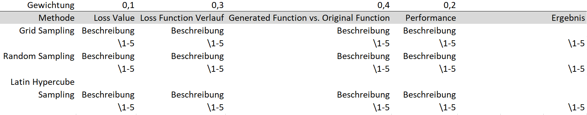{width="100%"}

## Gewichtung

-   Durchschnittlicher Trainingsloss - 10%
-   (Visual) Loss Function Verlauf - 30%
-   (Visual) Generated Function vs. Original Function - 40%
-   Performance - 20%

## Optimierungsbewertung

<x> 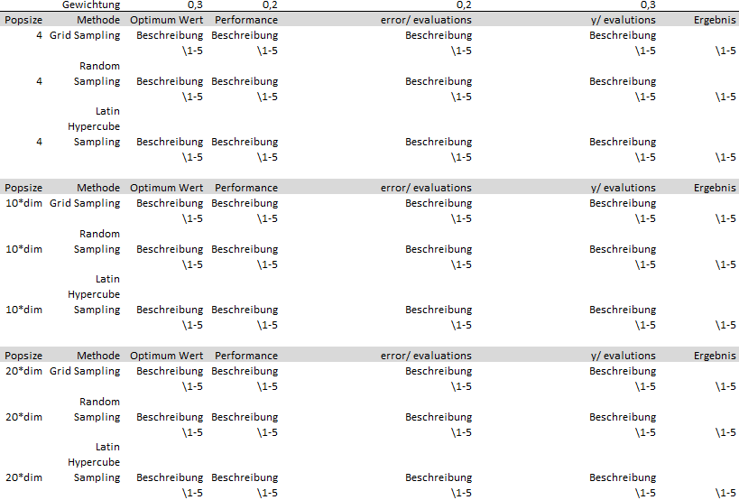{width="80%"}

## Gewichtung

-   Optimum Wert - 30%
-   Performance - 20%
-   Error / Evaluations - 20%
-   Y / Evaluations - 30%

## Finale Bewertungsmatrix

<x> 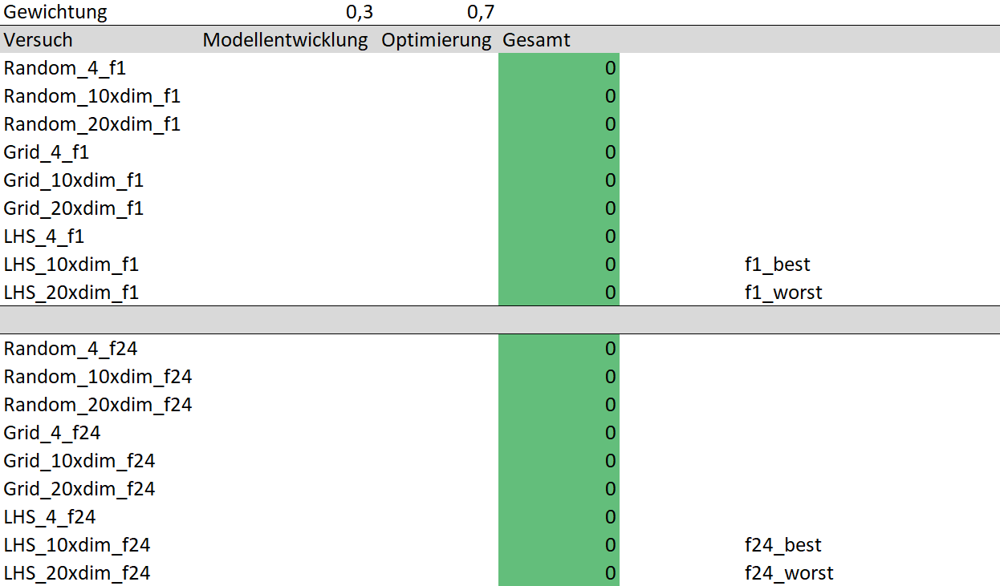{width="80%"}

## Gesamtbewertung

-   Systematische Analyse und Bewertung der Versuche im Rahmen der
    Modell- und Optimierungsbewertung
-   Fundierte Beurteilung der Modellleistung, Optimierungsalgorithmen
    und Versuche anhand der gewählten Bewertungskriterien
-   Berücksichtigung qualitativer und quantitativer Aspekte
-   Gewichtung:
    -   Modellbewertung - 30%
    -   Optimierungsbewertung - 70%
-   Bewertung des gesamten Versuchs möglich

## Versuchsbewertung

Bewertung der einzelnen Versuche anhand von:

-   Difficulty
-   Diversity
-   Flexibility
-   Relevance
-   Evaluation cost
-   Non-Smoothing

[Zaefferer, M., Fischbach, A., Naujoks, B. and Bartz-Beielstein, T.,
2017, July. Simulation-based test functions for optimization algorithms.
In Proceedings of the genetic and evolutionary computation conference
(pp. 905-912).]{style="font-size: 14px"}

# Umsetzung und Auswertung

Judith Romer

## Übersicht 1. Experiment

<x> 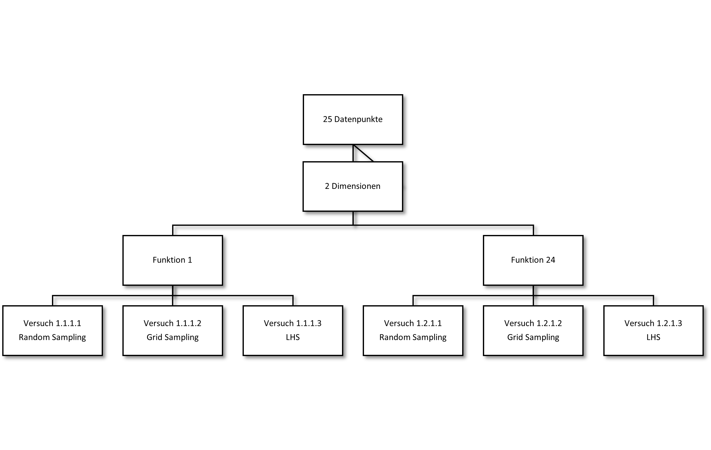{width="100%"}

## Übersicht 2. Experiment

<x> 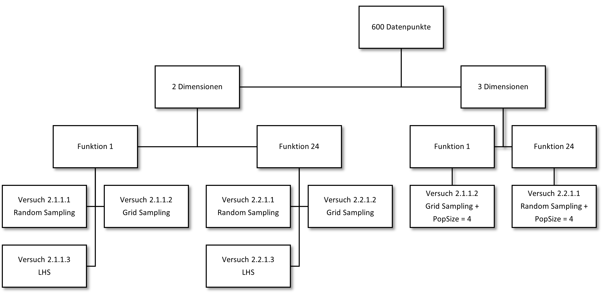{width="100%"}

## Übersicht 3. Experiment

<x> 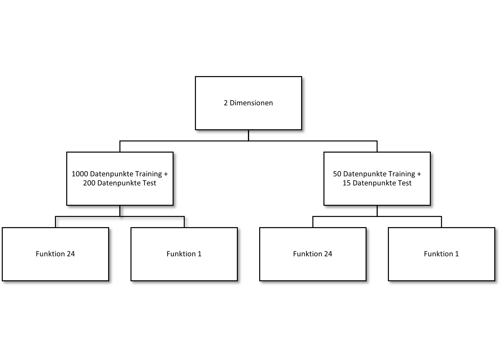{width="100%"}

# Eperiment 1

Judith Romer

## Versuch 1.1.1.2 - Bildvergleich

<center>

<x>{width="42%"}

<x>{width="42%"}{width="42%"}

</center>

## Versuch 1.1.1.2 - Y Wert / Evaluation

<br> <br>
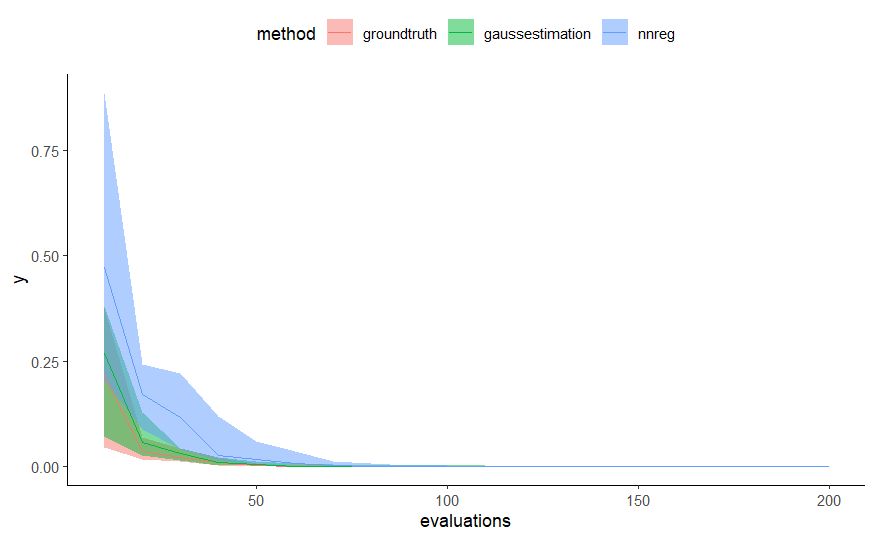{width="47%"}{width="47%"}

## Versuch 1.1.1.2 - Fehler / Evaluation

<br> <br>
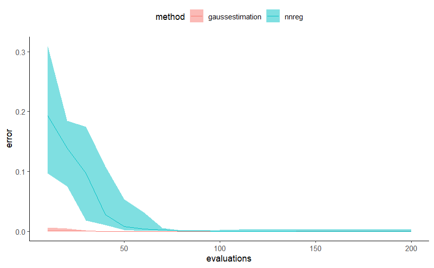{width="47%"}{width="47%"}

# Experiment 2

Judith Romer

## Versuch 2.2.1.1 - Bildvergleich 2D

<center>

<x>{width="42%"}

<x>{width="42%"}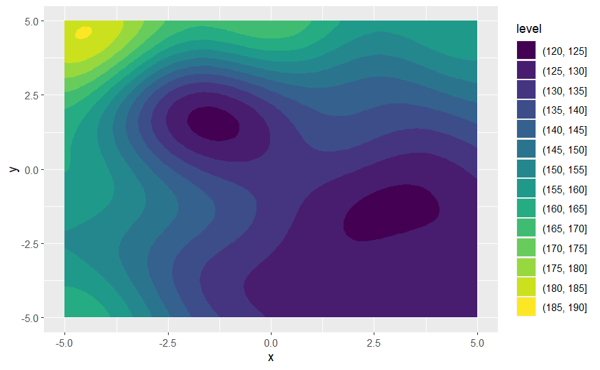{width="42%"}

</center>

## Versuch 2.2.2.1 - Bildvergleich 3D

<br> <br>
{width="47%"}{width="47%"}

## Versuch 2.2.1.1 & 2.2.2.1 - Y Wert / Evaluation

<br> <br>
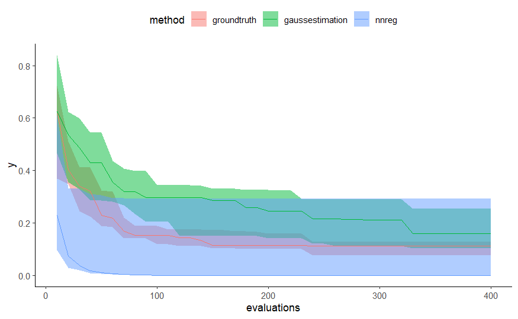{width="47%"}{width="47%"}

## Versuch 2.2.1.1 & 2.2.2.1 - Fehler / Evaluation

<br> <br>
{width="47%"}{width="47%"}

# Experiment 3

Isabel Janez

## VAE mit 50 Datenpunkten Funktion 1

<br> <br>
{width="47%"}{width="47%"}

## VAE mit 1000 Datenpunkten Funktion 1

<br> <br>
{width="47%"}{width="47%"}

## VAE mit 50 Datenpunkten Funktion 24

<br> <br>
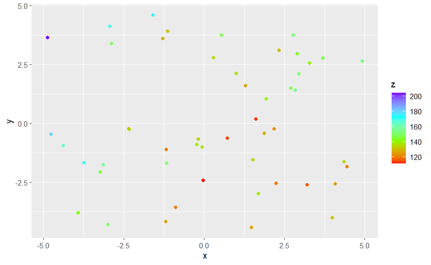{width="47%"}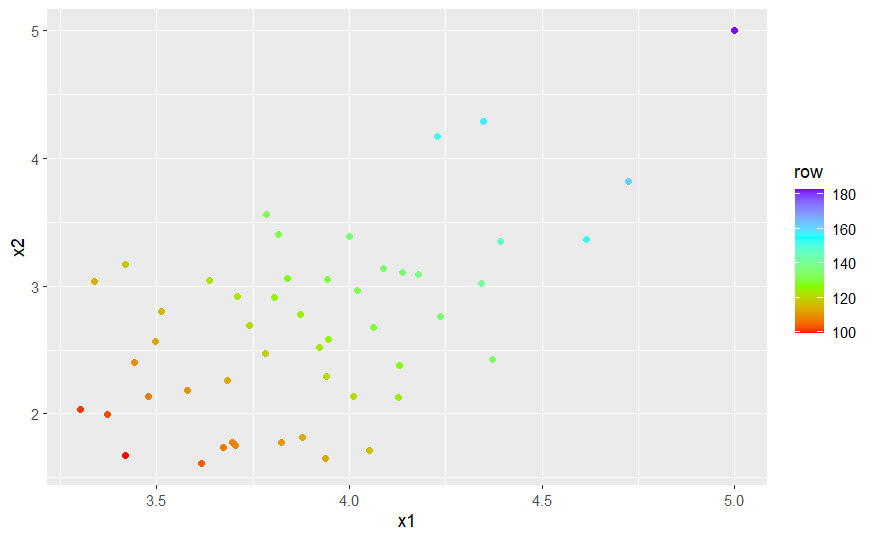{width="47%"}

## VAE mit 1000 Datenpunkten Funktion 24

<br> <br>
{width="47%"}{width="47%"}

# Beantwortung der Forschungsfragen

Isabel Janez

## Ist der Einsatz eines Variational Autoencoder als Datenerhebungstrategie sinnvoll?

-   Versuch wurde abgebrochen → sehr schlechte Ergebnisse vor allem bei
    50 Datenpunkten
-   nicht in der Lage die Verteilung über gesamten Raum zu lernen
-   Datenpunkteskala passt nur bedingt
-   representiert die 'Realität' nicht ausreichend
-   Dimensionsreduktion führt zu Problemen, dadurch verzerrte /
    gestauchte Darstellung
-   (Annahme) lokale Struktur wird erkannt und repräsentiert die
    Funktion

## 

für das vorliegende Problem konnte der VAE nicht zur Datenerhebung
eingesetzt werden

weiteres Vorgehen:

-   Modellarchitektur überarbeiten
-   GAN
-   CVAE

## Ist ein DNN besser geeignet zur Erzeugung der Testfunktion als ein Gaußsches Prozessmodell?

<center><x> {width="77%"}</center>

## Ist ein DNN besser geeignet zur Erzeugung der Testfunktion als ein Gaußsches Prozessmodell?

<center><x> {width="77%"}</center>

## Ist ein DNN besser geeignet zur Erzeugung der Testfunktion als ein Gaußsches Prozessmodell?

<br> <br> 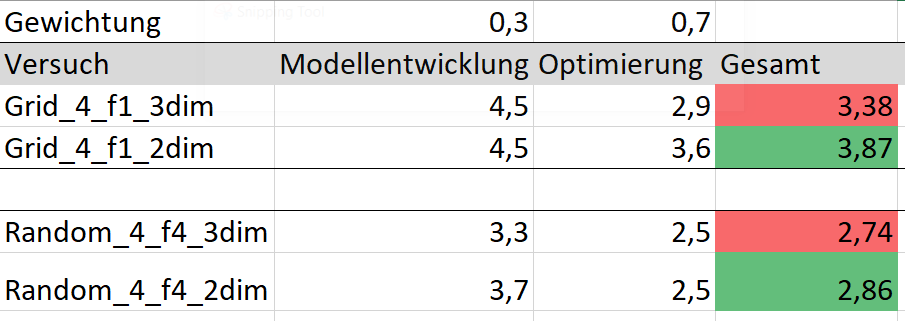{width="100%"}

## Ist ein DNN besser geeignet zur Erzeugung der Testfunktion als ein Gaußsches Prozessmodell?

Im vorliegenden Fall: nein, ein DNN ist nicht besser geeignet zur
Erzeugung der Testfunktion.

-   überwiegend ist Performance des Gaußschen Prozessmodells besser
-   höchste erreichte Punktzahl in Optimierung ist 3,6 / 5
-   niedrigste erreichte Punktzahl in Optimierung ist 1,3 / 5

## Ist der Einsatz von DNN geeignet?

-   [4\|5] Difficulty (Mehrdimensionalität 2+3, F1 wird gut
    nachgebildet, F24 ist zu komplex)
-   [5\|5] Diversity ()
-   [3\|5] Flexibility ()
-   [1\|5] Relevance ()
-   [1\|5] Evaluation cost ()
-   [1\|5] Non-Smoothing (nein, 2 DNNs hintereinander verworfen,
    Simulaton nicht erstellt)

im vorliegenden Fall: erreichte Punktzahl der Testfunktionen des DNN ist
2,5 / 5

# Schlussbetrachtung

Isabel Janez

## Fazit

-   Graußsche Prozessmodelle im vorliegenden Anwendungsfall besser
    geeignet
-   Anmerkung: es wurde nur die Estimation verglichen; kein Vergleich
    von Simulation
-   Tradeoff zwischen Rechenleistung und Komplexität des DNN

## Verworfene Ansätze

-   VAE als Regressionsmodell
-   VAE wegen Dimensionsreduktion nicht für Datenerhebung geeignet
-   Loss Function selber schreiben
-   L-BFGS-B als Optimierer: Abbruchkriterium funktioniert nicht korrekt
-   2 DNNs hintereinander für Abbildung der lokalen Struktur

## 2 DNN

<center>

<x>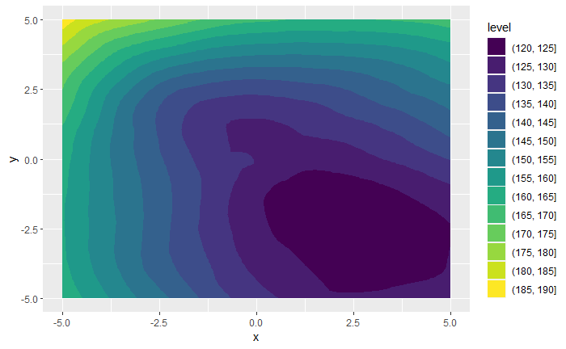{width="42%"}

<x>{width="42%"}{width="42%"}

</center>

## Ausblick

-   mehr Datenpunkte
-   mehr Dimensionen
-   andere Optimierer
-   Abbildung der lokalen Struktur mit dem neuronalen Netz durch
    Erstellung neuer Loss-Funktion, die nicht nur einzelne Punkte
    optimiert, sondern mehrere Punkte betrachtet
-   Vergleich von Graußscher Prozessmodell Simulation anstelle von
    Estimation

# Vielen Dank für die Aufmerksamkeit! Noch Fragen?

## Prüfungsleistung Aufteilung

-   Hanna Steinwender: Folie 1 bis Folie 8
-   Lena Hammerer: Folie 9 bis Folie 17
-   Luisa Ibele: Folie 18 bis Folie 26
-   Judith Romer: Folie 26 bis Folie 39
-   Isabel Janez: Folie 40 bis 57
