# Versuch 4.1 - VAE Datenerhebung
Modelleinstellung: siehe Versuchsaufbau
Training: 50
Test: 15
Epochs: 300
- Input Daten wurden nicht skaliert
- (Versuch) Output Daten x1,x2 auf ursprüngliche Verteilung im Raum zu reskalieren
-> Realität nur wenige Beobachtungen in der Realität vorhanden

## f1
Bild Fuktion
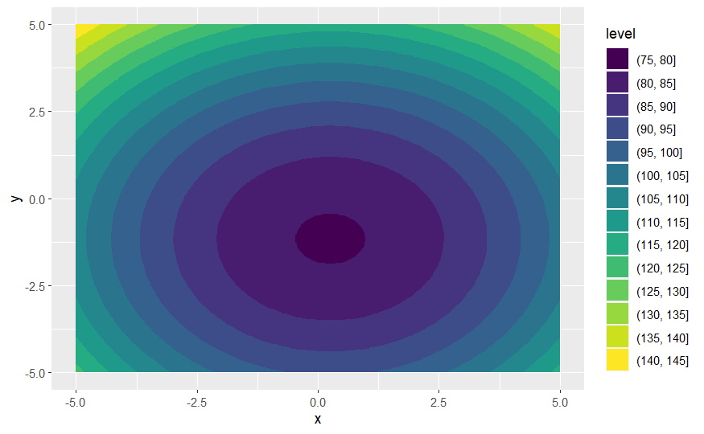

Bild Fuktion zugeschnitten

Bild Datenpunkte zufällig Training
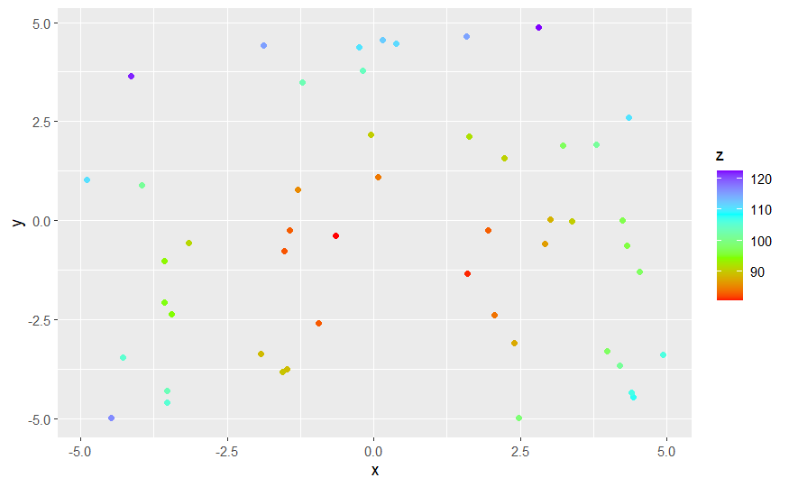

Bild Datenpunkte zufällig Test
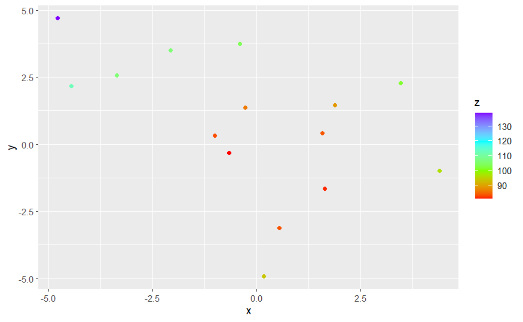

Bild Datenpunkte VAE

Bild Loss Function
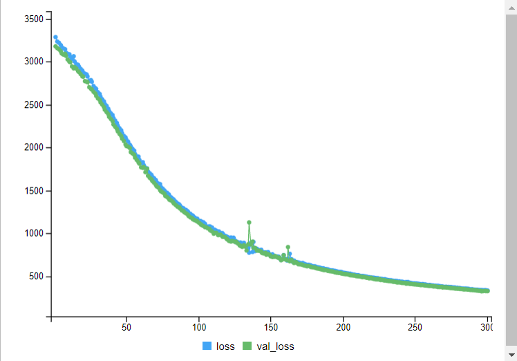

### Fazit
- nicht in der Lage die Verteilung über gesamten Raum zu lernen
- Globale Struktur wird im begrenzten Ausmaß erlernt
- Datenpunkteskala passt nur bedingt
- representiert die 'Realität' nicht ausreichend
- Loss Function -> Training und Test Verlauf in Ordnung jedoch nicht überagend gut

## f4
Bild Fuktion
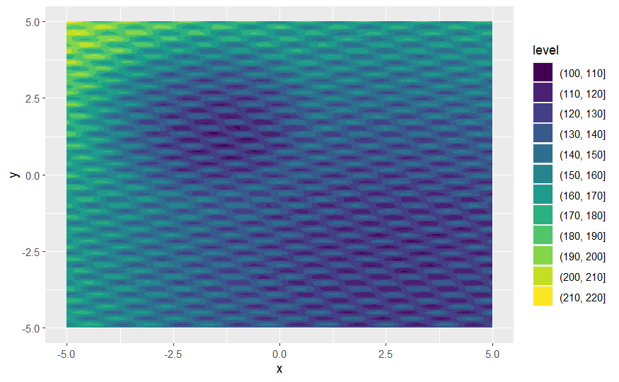

Bild Fuktion zugeschnitten

Bild Datenpunkte zufällig Training
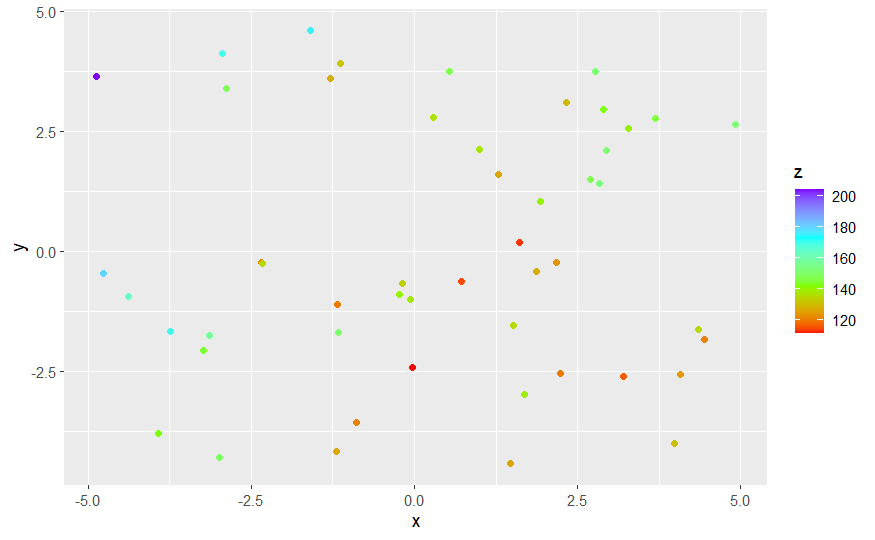

Bild Datenpunkte zufällig Test
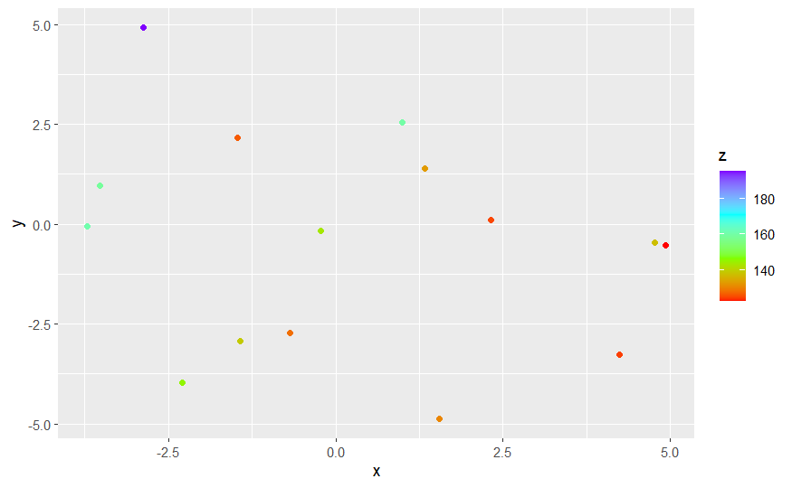

Bild Datenpunkte VAE
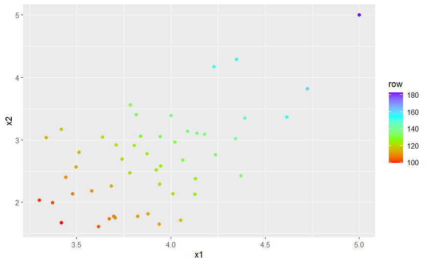

Bild Loss Function
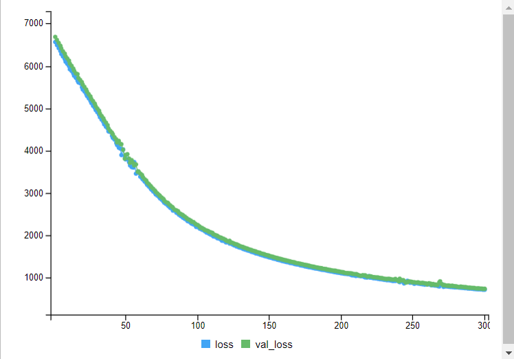

### Fazit
- nicht in der Lage die Verteilung über gesamten Raum zu lernen
- Globale Struktur wird nicht erkannt
- Datenpunkteskala passt nur bedingt
- representiert die 'Realität' nicht 
- Loss Function -> Training und Test Verlauf in Ordnung jedoch nicht überagend gut

---> Versuch abgebrochen

# Versuch 4.2 - VAE Datenerhebung
Modelleinstellung: siehe Versuchsaufbau
Training: 1000
Test: 200
Epochs: 100
- Input Daten wurden nicht skaliert
- (Versuch) Output Daten x1,x2 auf ursprüngliche Verteilung im Raum zu reskalieren
-> Realität nur wenige Beobachtungen in der Realität vorhanden

## f1
Bild Fuktion

Bild Fuktion zugeschnitten

Bild Datenpunkte zufällig Training
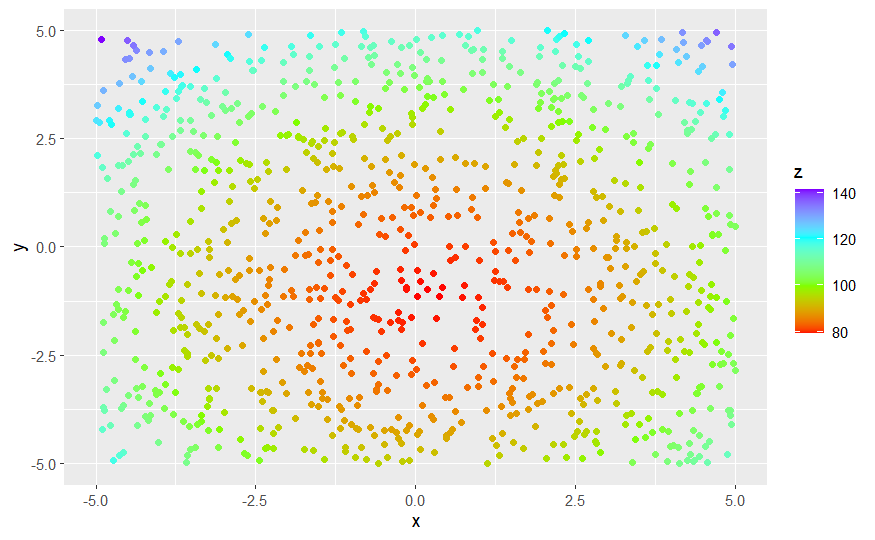

Bild Datenpunkte zufällig Test
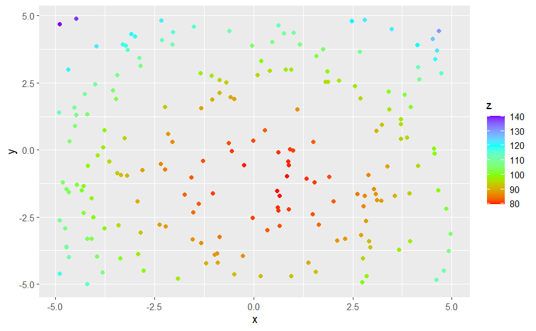

Bild Datenpunkte VAE
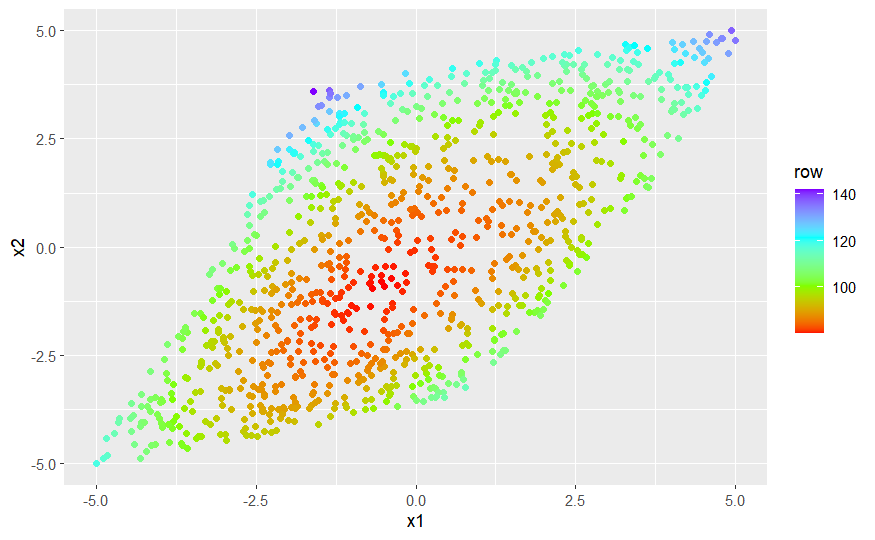

Bild Loss Function
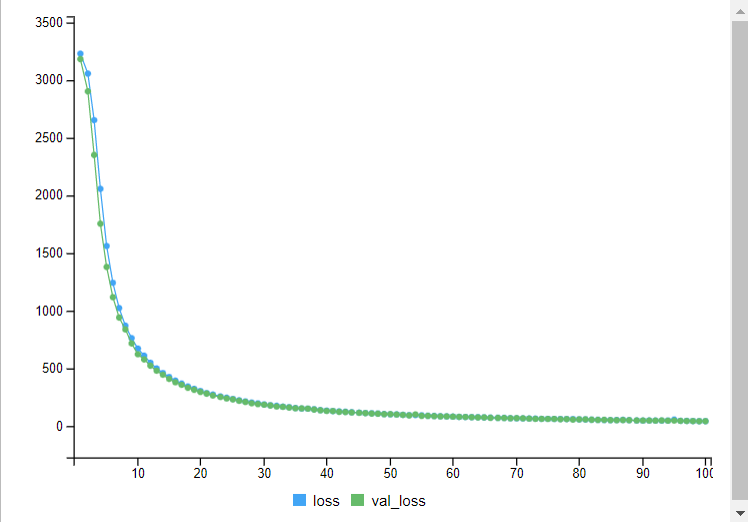

### Fazit
- bessere Performance + Ergebnisse als bei 50 Datenpunkten
- Loss Function -> Training und Test Verlauf gut und benötigt viel weniger Epochen
- lernt Verteilung an sich sehr gut, Problem: scheint Dimensionsreduktion anzuwenden, dadurch verzerrte / gestauchte Darstellung
- nicht praktikabel für geplanten Einsatz

## f4
Bild Fuktion

Bild Fuktion zugeschnitten

Bild Datenpunkte zufällig Training
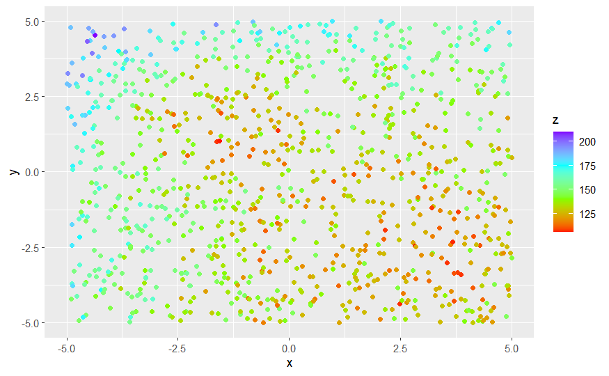

Bild Datenpunkte zufällig Test
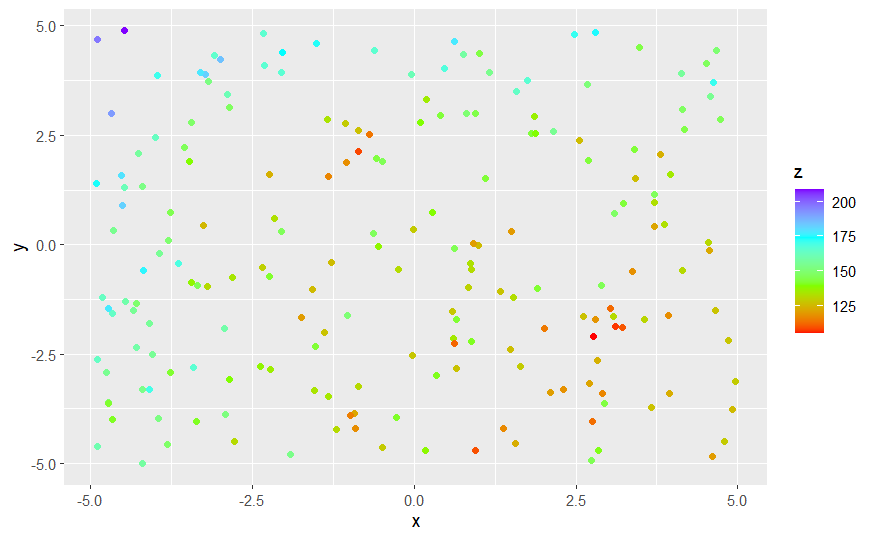

Bild Datenpunkte VAE
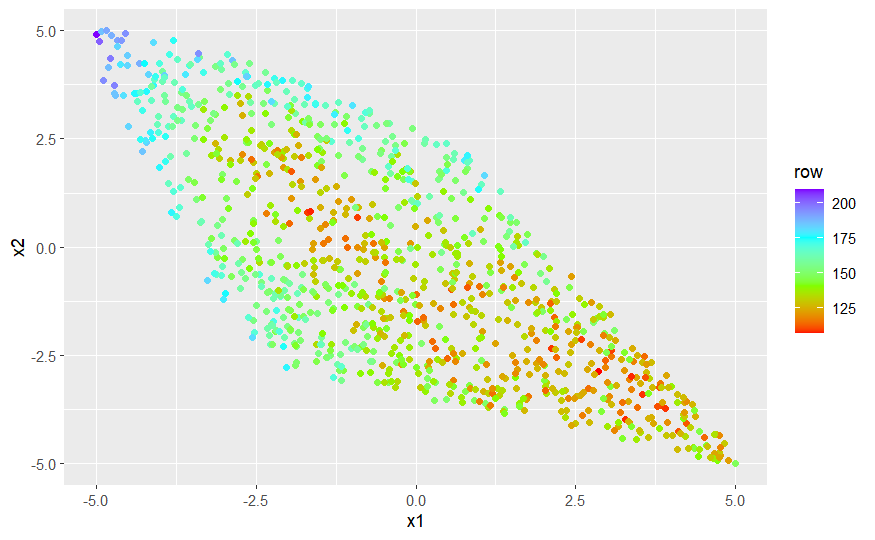

Bild Loss Function
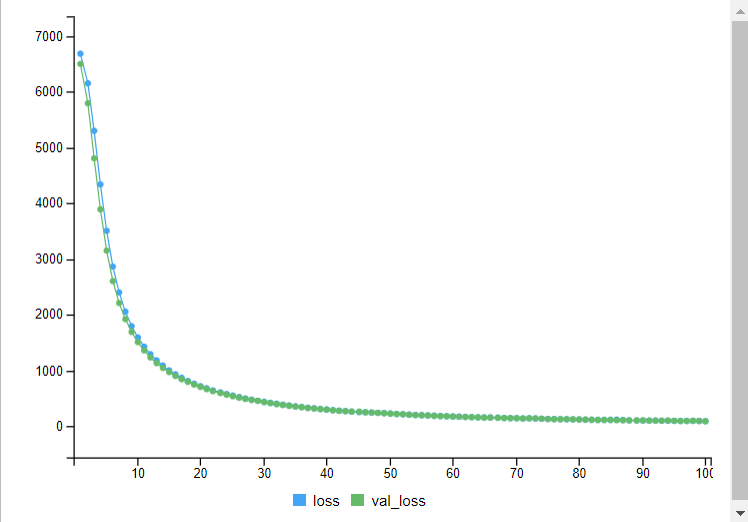

### Fazit
- bessere Performance + Ergebnisse als bei 50 Datenpunkten
- Loss Function -> Training und Test Verlauf gut und benötigt viel weniger Epochen
- lernt Verteilung an sich sehr gut, Problem: scheint Dimensionsreduktion anzuwenden, dadurch verzerrte / gestauchte Darstellung
- nicht praktikabel für geplanten Einsatz
- (Annahme) lokale Struktur wird erkannt und representiert die Funktion

---> Versuch abgebrochen

|-> in Realität ist Groun Truth nicht bekannt, somit ist die Rekonstruktion nicht möglich
|-> nicht für den angedachten Verwendungszweck nicht geeignet
|-> Ausblick: Modell nochmals anschauen (Layer, Parameter, etc.), besseres Lernen der Funktion, GAN oder CVAE ggf. ausprobieren #

------------------------------------------------------------------------

